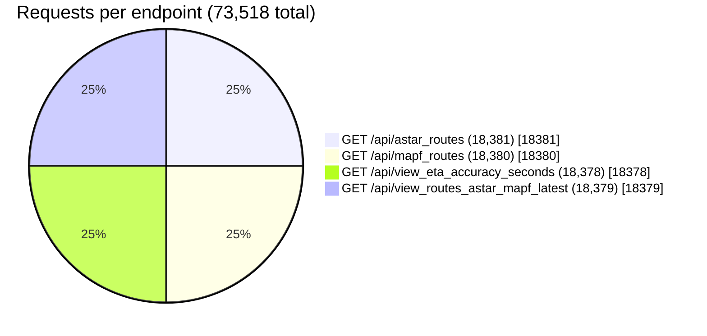
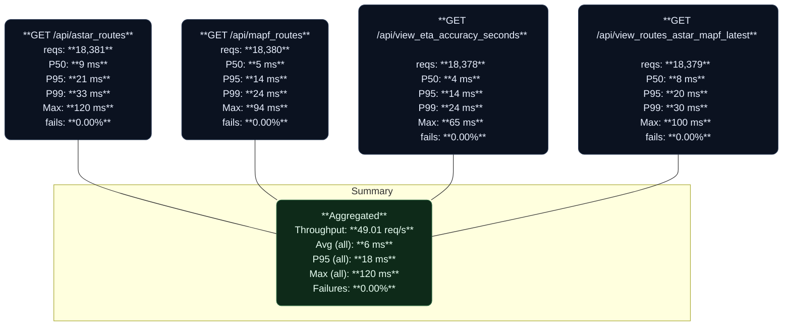

---

# UrbanOS-PoC

UrbanOS-PoC is a **Proof of Concept** built on the [Sovereign, Self-Healing AI Architecture](https://github.com/pablo-chacon/Sovereign-Self-Healing-AI/blob/main/README.md).

---

*“Transit isn’t just supply. It’s supply + human behavior. UrbanOS is the first system that optimizes the human side in real-time, without stress or coercion.”*
— *Emil Karlsson, Creator of UrbanOS and Sovereign, Self-Healing AI*

\[[UrbanOS Whitepaper](https://github.com/pablo-chacon/UrbanOS-POC/wiki/UrbanOS%E2%80%90PoC-Whitepaper)]

\See the [[UrbanOS Wiki](https://github.com/pablo-chacon/UrbanOS-POC/wiki)] example of [[Data Warehouse Feed integration](https://github.com/pablo-chacon/UrbanOS-POC/wiki/Datawarehouse-feed-example)] and \[[InfluxDB Aggregation Feed integration](https://github.com/pablo-chacon/UrbanOS-POC/wiki/InfluxDB-Aggregation-Feed-Example)]

---

It is **sovereign** because:

* Hardware agnostic: runs on commodity CPUs, containers, and cloud/on-prem equally well.
* No humans in the loop: no prompts, no manual decision-making, fully automated.
* Decisions are based only on **machine data**, not human input.

It is **self-healing** because:

* Operates a **26h Machine Learning / Deep Learning loop** that continuously re-learns from trajectories, POIs, patterns, and hotspots.
* Adjusts routing and predictions to deviations automatically.
* Never requires human intervention to maintain consistency.

UrbanOS-PoC targets **Urban Flow**: minimizing friction for residents, operators, and planners.
Compatible with virtually any **IoT unit** and **API**.

Currently the PoC integrates **Stockholm’s Lokaltrafik (SL)** public transport feeds via [Trafiklab](https://www.trafiklab.se/):

* Static GTFS: [GTFS Regional](https://www.trafiklab.se/api/gtfs-datasets/gtfs-regional/#realtime-data)
* GTFS-RT (Samtrafiken Open Data):

  * Service Alerts → `https://opendata.samtrafiken.se/gtfs-rt/{operator}/ServiceAlerts.pb?key={apikey}`
  * Trip Updates → `https://opendata.samtrafiken.se/gtfs-rt/{operator}/TripUpdates.pb?key={apikey}`
  * Vehicle Positions → `https://opendata.samtrafiken.se/gtfs-rt/{operator}/VehiclePositions.pb?key={apikey}`

---

**Simulation**:

* Recommended minimum clients 100 to ensure enough data.
* **MQTT IoT Stream Simulation** pre-release test 250 clients in 10 min.
* **MQTT Bulk Simulation** pre-release test 100 clients in 3 min.
* [Locust MQTT simulation scripts](https://github.com/pablo-chacon/mqtt-simulations/blob/main/README.md)

---

## Locust Load Test

A dedicated load test was executed with **\~49 req/s aggregated** across four endpoints and **0.00% failures**.





> **Interpretation**
>
> * All four endpoints are comfortably under **P95 ≤ 21 ms**, with zero failures across **73,518** requests.
> * `GET /api/mapf_routes` and `GET /api/view_eta_accuracy_seconds` are the fastest (P50 **5 ms** and **4 ms** respectively).
> * Rare long tails exist (max 120 ms) but P99 values remain tight (≤ **33 ms**), indicating consistent latency.

---

**MQTT-Client Templates**:

* Client templates (Go, Node.js, Python)
* [MQTT Client Templates](https://github.com/pablo-chacon/mqtt-client-templates)

---

**MQTT-Client Templates**:

* Client templates (Go, Node.js, Python)
* [MQTT Client Templates](https://github.com/pablo-chacon/mqtt-client-templates)

---

## Architecture at a Glance

```
flowchart TD
    subgraph Ingestion["🔌 Ingestion Layer"]
        MQTT[MQTT Broker]
        Sub[Subscriber]
        GTFS[GTFS / GTFS-RT API]
    end

    subgraph Storage["🗄 Storage & Processing"]
        Geo[Geodata (26h window)]
        Traj[Trajectories (28d window)]
        Patterns[User Patterns]
        POIs[Points of Interest]
        Hotspots[Hotspots]
    end

    subgraph Intelligence["🧠 Sovereign Self-Healing AI (26h loop)"]
        Models[ML/DL Models]
        FuturePOI[Future POI Prediction]
        Routing[A* / MAPF / LBRP]
        Schedule[Weekly Schedule Generator]
    end

    subgraph Outputs["📡 Outputs"]
        Views[Postgres Views / APIs]
        Producer[Producer → Client / Planner Dashboards]
    end

    MQTT --> Sub --> Geo
    GTFS --> Geo
    Geo --> Traj
    Traj --> Patterns
    Traj --> POIs
    Traj --> Hotspots
    Patterns --> Models
    POIs --> Models
    Hotspots --> Models
    Models --> FuturePOI
    Models --> Routing
    Routing --> Schedule
    FuturePOI --> Schedule
    Schedule --> Views
    Views --> Producer
```

---

## Quickstart

Run the PoC locally with Docker Compose.

```bash
# Clone repo
git clone https://github.com/pablo-chacon/urbanos-poc.git
cd urbanos-poc

# Copy environment file (edit with your own DB/API keys)
cp .env.example .env

# Start all services
docker-compose -f docker-compose.yml -f docker-compose.dev.yml up -d --build

# Check container health
docker-compose ps

# Verify Postgres is ready
docker-compose exec postgres pg_isready -U "$POSTGRES_USER" -d "$POSTGRES_DB"

# Run health checklist
./health.sh uos_full/uos_full --stop-on-fail
```

The API will be available at:
👉 `http://localhost:8181/api/`

Example endpoints:

* `/api/trajectories` → migrated client trajectories
* `/api/pois` → detected Points of Interest
* `/api/view_astar_eta` → A\* routing with ETA
* `/api/view_predicted_routes_schedule` → weekly schedule predictions

---

## API Examples

Test the API with simple `curl` calls:

```bash
# 1. Fetch latest trajectories
curl -s http://localhost:8181/api/trajectories | jq

# 2. Get predicted POIs sequence (next likely destinations)
curl -s http://localhost:8181/api/predicted_pois_sequence | jq

# 3. Query A* routes with ETA
curl -s http://localhost:8181/api/view_astar_eta | jq
```

👉 All responses are returned as JSON. Use `jq` (or any JSON viewer) for pretty-printing.

---

## UrbanOS wiki and related resources

* [**UrbanOS Wiki (main hub)**](https://github.com/pablo-chacon/UrbanOS-POC/wiki)

  * [UrbanOS Whitepaper](https://github.com/pablo-chacon/UrbanOS-POC/wiki/UrbanOS%E2%80%90PoC-Whitepaper)
  * [Data Warehouse Feed Example](https://github.com/pablo-chacon/UrbanOS-POC/wiki/Datawarehouse-feed-example)
  * [InfluxDB Aggregation Feed Example](https://github.com/pablo-chacon/UrbanOS-POC/wiki/InfluxDB-Aggregation-Feed-Example)
* [**UOS-New-Trajectories-Listener**](https://github.com/pablo-chacon/UOS-New-Trajectories-Listener) — external module for anonymized KPI export to InfluxDB

---

## License

UrbanOS-PoC is licensed under the **Apache License, Version 2.0**.
See [`LICENSE`](./LICENSE). SPDX: `Apache-2.0`.

---

## Disclaimer / Assumption of Risk

This software is provided **“AS IS” and “AS AVAILABLE,” without warranties** of any kind, express or implied, including but not limited to merchantability, fitness for a particular purpose, and non-infringement. **You use UrbanOS-PoC at your own risk.** The authors and contributors **shall not be liable** for any claim, damages, or other liability, whether in an action of contract, tort, or otherwise, arising from, out of, or in connection with the software or the use or other dealings in the software.

UrbanOS-PoC is a **proof of concept** intended for research and planning workflows.
**It is not certified for safety-critical use**, including but not limited to emergency dispatch, positive train control, traffic signals, or medical/clinical decision making.

You, the deployer, are solely responsible for:

* **Authentication, authorization, and key management** for any connected systems.
* **Data protection and regulatory compliance** (e.g., GDPR/CCPA, public records, sector-specific rules).
* **Dataset licenses and API terms** (e.g., GTFS/GTFS-RT feeds, keys, rate limits).
* **Operational monitoring and incident response** in your environment.

---

## Ethical Use Policy (No Mass Surveillance)

UrbanOS aims to improve **urban flow** and reduce friction for residents, operators, and planners. You agree **not** to use this project to enable:

* **Mass surveillance**, persistent tracking of identifiable individuals, or re-identification of anonymized data.
* **Profiling or discrimination** against protected classes or sensitive attributes.
* **Predictive policing** or military targeting of persons.
* **Covert monitoring** of employees, students, or residents without clear legal basis and informed consent.

This repository intentionally avoids storing personal identifiers. **Any downstream modification that introduces person-level identification is your responsibility** and must comply with applicable law and ethics.

If you cannot agree to these terms, **do not use UrbanOS-PoC**.

---

## Safety Notes

* **Not for real-time control.** Outputs are advisory for planners and dashboards.
* **Latency and accuracy vary** with feeds and deployment, validate before making operational decisions.
* **Deployer-controlled storage.** All long-term storage, backups, and retention policies are your responsibility.

---

## Trademarks

“UrbanOS” may be used to describe unmodified, compliant distributions. **Do not imply endorsement** by the authors or contributors. You must clearly mark forks and materially modified versions.

---

## Contact

For questions, collaborations, or feedback:
📧 Email: [pablo-chacon-ai@proton.me](mailto:pablo-chacon-ai@proton.me)
🌐 GitHub: [https://github.com/pablo-chacon](https://github.com/pablo-chacon)

---

## 💡 Support the Project

If you find this project useful and would like to support future development, you can send ETH to:
`0x47eb960c631B54b8907241f42808170e8200f416`

*Donations are voluntary and non-refundable. Thank you for your support! ❤️*

---

